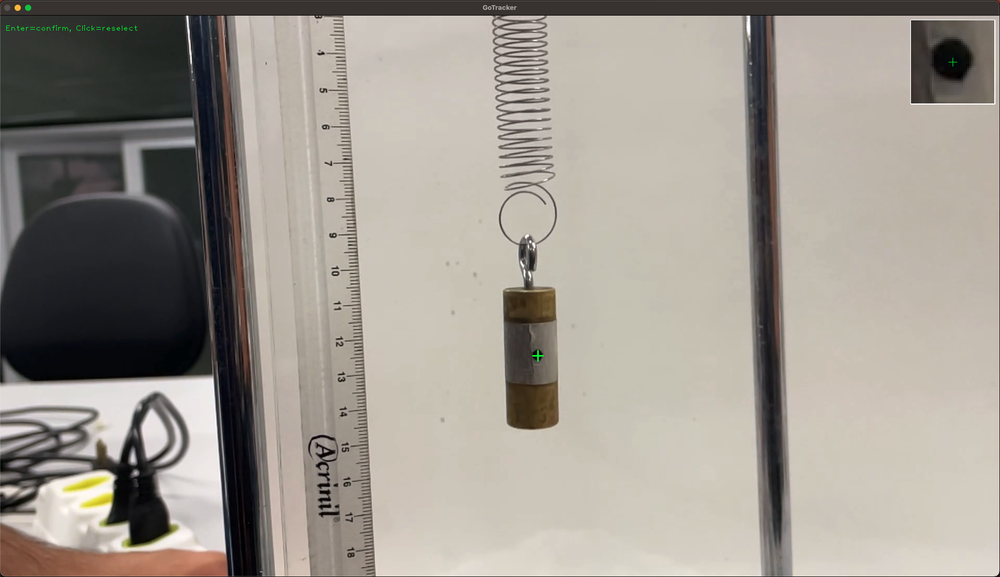
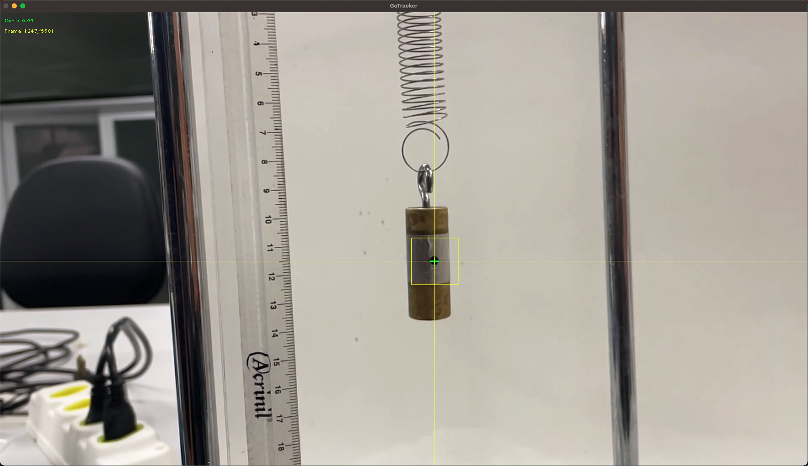
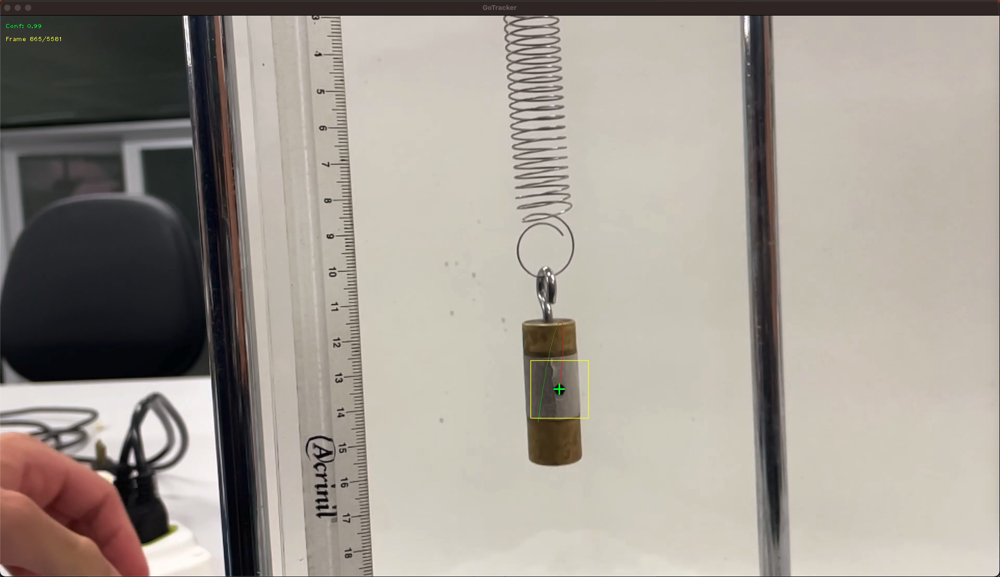
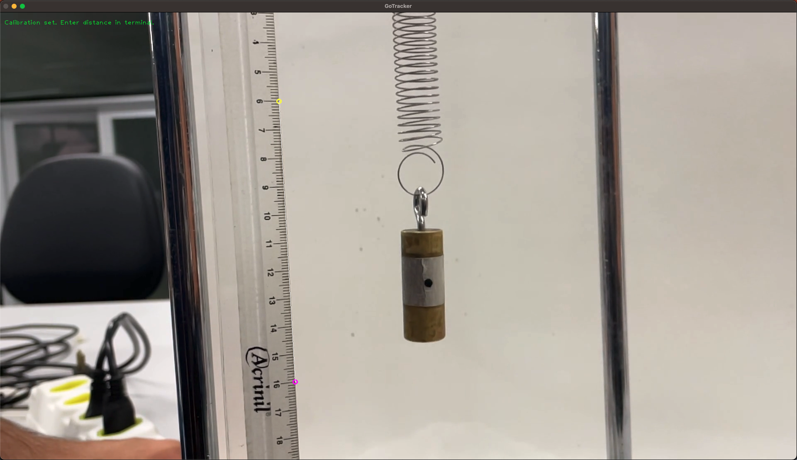
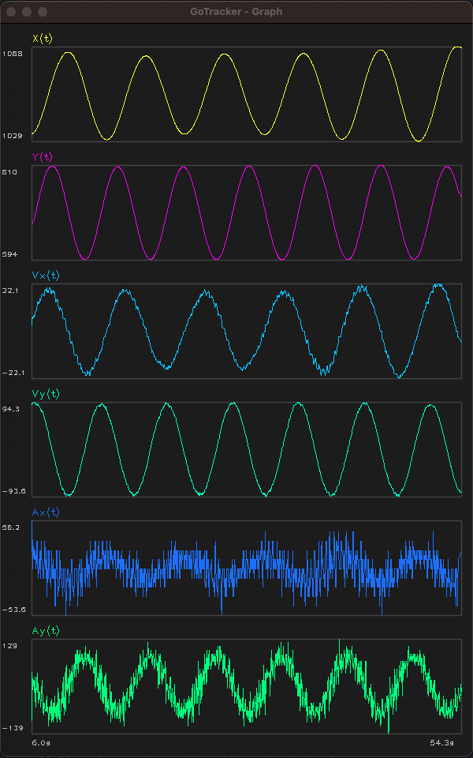

# go-tracker


A lightweight, high-performance video point-mass tracker for physics experiments. Inspired by [Tracker](https://physlets.org/tracker/) (Open Source Physics), but focused on a single task: tracking a point of mass in a video and exporting its position over time.

GoTracker uses OpenCV template matching (TM_CCOEFF_NORMED) with NEON SIMD acceleration on Apple Silicon and optional CUDA GPU acceleration on NVIDIA systems. Typical throughput is 200-500 FPS on modern hardware.

## What it does

1. You open an MP4 video
2. You click on the point you want to track
3. GoTracker follows that point across every frame using template matching
4. If the tracker loses the point, it pauses so you can click to realign
5. You get a CSV file with `time, x, y` columns

The x/y coordinates are in pixels (relative to the video frame). Optional scale calibration converts to real-world units.

---

## Installation

### Option A: Docker (recommended for most users)

This is the easiest way to get started. You only need Docker installed.

#### 1. Install Docker

- **Linux**: https://docs.docker.com/engine/install/
- **macOS**: https://docs.docker.com/desktop/install/mac-install/
- **Windows**: https://docs.docker.com/desktop/install/windows-install/

#### 2. Build the image

```bash
git clone https://github.com/thalestmm/go-tracker.git
cd go-tracker
docker build -t go-tracker .
```

#### 3. Run (platform-specific)

Since GoTracker has a GUI window, the container needs access to your display.

**Linux:**

```bash
xhost +local:docker
docker run -it --rm \
  -e DISPLAY=$DISPLAY \
  -v /tmp/.X11-unix:/tmp/.X11-unix \
  -v $(pwd):/data \
  go-tracker -video /data/your_video.mp4 -output /data/tracking.csv
xhost -local:docker
```

**macOS (requires XQuartz):**

1. Install XQuartz: `brew install --cask xquartz`
2. Open XQuartz, go to Preferences > Security, and check "Allow connections from network clients"
3. Log out and log back in (or restart)
4. Then run:

```bash
xhost +localhost
docker run -it --rm \
  -e DISPLAY=host.docker.internal:0 \
  -v /tmp/.X11-unix:/tmp/.X11-unix \
  -v $(pwd):/data \
  go-tracker -video /data/your_video.mp4 -output /data/tracking.csv
xhost -localhost
```

**Windows (requires VcXsrv):**

1. Install VcXsrv from https://sourceforge.net/projects/vcxsrv/
2. Launch XLaunch with "Disable access control" checked
3. In PowerShell:

```powershell
docker run -it --rm `
  -e DISPLAY=host.docker.internal:0.0 `
  -v ${PWD}:/data `
  go-tracker -video /data/your_video.mp4 -output /data/tracking.csv
```

---

### Option B: Build from source

#### Prerequisites

- **Go** 1.25 or later: https://go.dev/dl/
- **OpenCV 4.x** with development headers
- **pkg-config**

#### Install OpenCV

**macOS (Homebrew):**

```bash
brew install opencv pkg-config
```

**Ubuntu/Debian:**

```bash
sudo apt-get update
sudo apt-get install -y libopencv-dev pkg-config
```

**Fedora:**

```bash
sudo dnf install opencv-devel pkgconf-pkg-config
```

**Arch Linux:**

```bash
sudo pacman -S opencv pkgconf
```

#### Build

```bash
git clone https://github.com/thalestmm/go-tracker.git
cd go-tracker
go build -o go-tracker .
```

#### Build with CUDA support (optional, NVIDIA GPU required)

If your system has an NVIDIA GPU with CUDA and OpenCV was compiled with CUDA support:

```bash
go build -tags cuda -o go-tracker .
```

---

## Usage

```
go-tracker -video <path.mp4> [options]
```

### Options

| Flag | Default | Description |
|------|---------|-------------|
| `-video` | *(required)* | Path to MP4 video file |
| `-output` | `tracking.csv` | Output CSV file path |
| `-template-size` | `15` | Template half-size in pixels (template is `2n+1` square) |
| `-search-margin` | `40` | Search margin around last known position in pixels |
| `-confidence` | `0.6` | Minimum confidence threshold (0.0 to 1.0) |
| `-start-frame` | `0` | Start tracking from this frame number |
| `-start-time` | `0` | Start tracking from this time in seconds (overrides `-start-frame`) |
| `-axes` | `false` | Display X/Y reference axes through the tracking point |
| `-turbo` | `false` | Skip rendering for maximum speed (2000+ FPS). Auto-pauses on lost track |
| `-trail` | `0` | Draw trajectory trail of last N positions (0=off) |
| `-graph` | `false` | Open a real-time graph window showing X(t) and Y(t) |
| `-smooth` | `0` | Smoothing window for graph display (e.g., 10). Does not affect CSV output |
| `-calibrate` | `false` | Calibrate pixel-to-real-world scale before tracking |
| `-unit` | `m` | Unit label for calibrated output (e.g., `m`, `cm`, `mm`) |
| `-derivatives` | `false` | Include `vx, vy, ax, ay` columns in CSV. With `-graph`, shows real-time derivative plots |
| `-export-confidence` | `false` | Include confidence column in CSV output |
| `-export-video` | `""` | Export annotated video with overlay to this path (e.g., `output.mp4`) |

### Examples

Basic usage:

```bash
./go-tracker -video experiment.mp4
```

Custom output path and confidence threshold:

```bash
./go-tracker -video pendulum.mp4 -output pendulum_data.csv -confidence 0.5
```

Start tracking from 5 seconds in, with trail and axes:

```bash
./go-tracker -video projectile.mp4 -start-time 5.0 -trail 50 -axes
```

Turbo mode for maximum speed:

```bash
./go-tracker -video long_experiment.mp4 -turbo
```

Full physics lab workflow with calibration, derivatives, and video export:

```bash
./go-tracker -video pendulum.mp4 -calibrate -unit cm -derivatives -export-video annotated.mp4
```

Real-time graphing with smoothing:

```bash
./go-tracker -video projectile.mp4 -graph -derivatives -smooth 10
```

---

## Keyboard Controls

| Key | Context | Action |
|-----|---------|--------|
| **ESC** | Tracking | Stop tracking and export results |
| **Space** or **P** | Tracking | Pause tracking |
| **Left arrow** | Paused | Step one frame backward |
| **Right arrow** | Paused | Step one frame forward |
| **Space** | Paused | Resume tracking from current position |
| **Mouse click** | Paused | Realign tracking to clicked point |
| **Enter/Space** | Point selection | Confirm selection (with zoom preview) |
| **Mouse click** | Point selection | Reselect a different point |

---

## Workflow

### 1. Scale calibration (optional)

If you use `-calibrate`, you'll first be asked to click two reference points with a known real-world distance. Both points are shown (cyan and magenta) with a connecting line. You then enter the distance in the terminal. This converts all output to real-world units.

### 2. Select the tracking point

When the video opens, you'll see the first frame. Click on the object you want to track (e.g., a ball, pendulum bob, or marker). A **4x zoomed inset** appears in the top-right corner so you can verify the exact pixel selected. Press **Enter** or **Space** to confirm, or click again to reselect.

**Tip:** Click on a visually distinctive point with good contrast against the background.

### 3. Tracking

The tracker automatically follows the point frame by frame. You'll see:
- A **green crosshair** on the tracked point
- A **yellow rectangle** showing the search region
- A **confidence score** in the top-left corner
- A **trajectory trail** if `-trail N` is enabled (fading green-to-red polyline)
- **Reference axes** if `-axes` is enabled (full-frame lines through the tracked point)

### 4. Pause and frame stepping

Press **Space** at any time to pause. While paused:
- Use **left/right arrow keys** to step through frames one at a time
- **Click** to realign the tracking point to a new position
- Press **Space** to resume tracking

If the confidence drops below the threshold, tracking pauses automatically.

### 5. Output

When tracking finishes (video ends or you press ESC), the data is saved to CSV:

```csv
time,x,y
0.000000,320,240
0.033333,322,238
0.066667,325,234
...
```

- **time**: seconds from video start (`frame_number / fps`)
- **x**: horizontal pixel position (0 = left edge)
- **y**: vertical pixel position (0 = top edge)

With `-calibrate -unit cm`, the CSV includes calibrated columns:

```csv
time,x,y,x_cm,y_cm
```

With `-derivatives`, velocity and acceleration columns are added:

```csv
time,x,y,vx_cm/s,vy_cm/s,ax_cm/s2,ay_cm/s2
```

### 6. Real-time graphs

With `-graph`, a second window shows live plots of X(t) and Y(t), auto-scaling to the data range. Add `-derivatives` to also see Vx(t), Vy(t), Ax(t), Ay(t). Use `-smooth N` to apply a moving average to the graph display (does not affect CSV data).

### 7. Video export

With `-export-video output.mp4`, an annotated video is written after tracking completes, with crosshairs and trajectory trail baked in.

---

## Tuning Tips

### Template size (`-template-size`)

- **Default: 15** (creates a 31x31 pixel template)
- Increase for larger objects or low-contrast scenes
- Decrease for small, sharp markers
- Rule of thumb: the template should fully contain the object plus a few pixels of background

### Search margin (`-search-margin`)

- **Default: 40** pixels beyond the template in each direction
- Increase if the object moves fast between frames
- Decrease for slow-moving objects (improves performance)
- Adaptive mode automatically increases the margin when the object accelerates

### Confidence threshold (`-confidence`)

- **Default: 0.6** (range: 0.0 to 1.0)
- Lower values tolerate more drift but may track the wrong thing
- Higher values trigger realignment more often
- Start with the default and adjust based on your video

---

## Output Analysis

The CSV output works directly with common data analysis tools:

**Python (matplotlib):**

```python
import pandas as pd
import matplotlib.pyplot as plt

df = pd.read_csv("tracking.csv")
plt.plot(df["x"], df["y"])
plt.xlabel("x (pixels)")
plt.ylabel("y (pixels)")
plt.title("Trajectory")
plt.gca().invert_yaxis()  # pixel y increases downward
plt.axis("equal")
plt.show()
```

**Python (position vs time):**

```python
import pandas as pd
import matplotlib.pyplot as plt

df = pd.read_csv("tracking.csv")

fig, (ax1, ax2) = plt.subplots(2, 1, sharex=True)
ax1.plot(df["time"], df["x"])
ax1.set_ylabel("x (pixels)")
ax2.plot(df["time"], df["y"])
ax2.set_ylabel("y (pixels)")
ax2.set_xlabel("Time (s)")
plt.tight_layout()
plt.show()
```

**LibreOffice / Excel:**

Open the CSV file directly. The columns are comma-separated and ready for charting.

---

## How It Works

GoTracker uses **normalized cross-correlation** (`TM_CCOEFF_NORMED`) for template matching. When you click on a point:

1. A small square region (the "template") is captured around your click
2. For each subsequent frame, the tracker searches a region around the last known position
3. The best match within that search region becomes the new position
4. If the match quality (confidence) drops too low, tracking pauses for realignment

The template is **never updated** during normal tracking to prevent cumulative drift. It only changes when you explicitly realign.

The search region adapts to the object's velocity: faster objects get a larger search region automatically.

---

## Performance ⚡

On Apple M4 Pro, per-frame breakdown:

| Mode | Decode | Track | Display | Total | FPS |
|------|--------|-------|---------|-------|-----|
| Normal | ~0.2 ms | ~0.5 ms | ~20 ms | ~20.7 ms | ~48 |
| Turbo | ~0.2 ms | ~0.3 ms | 0 ms | ~0.6 ms | **2000+** |

In normal mode, the bottleneck is the macOS GUI event loop (~10ms per `WaitKey`). Turbo mode (`-turbo`) skips all rendering and only pauses when the tracker loses confidence, achieving 2000+ FPS.

Performance metrics are printed after every run, broken down by decode, track, and display time.

---

## Screenshots

### Point selection with zoom preview

After clicking on the object to track, a 4x zoomed inset appears in the top-right corner for precise confirmation.



### General tracking

Real-time tracking with crosshair, search region, and confidence display.



### Trajectory trail

With `-trail N`, the last N tracked positions are drawn as a fading polyline behind the crosshair.



### Scale calibration

With `-calibrate`, click two reference points with a known distance to convert pixel coordinates to real-world units.



### Real-time graphs

With `-graph -derivatives`, live plots of position, velocity, and acceleration are shown in a separate window.



---

## Troubleshooting

### "Failed to open video"

- Make sure the file exists and is a valid MP4 (H.264 or H.265 encoded)
- Try playing the video with VLC or another player first
- Some codecs may require additional FFmpeg libraries

### Tracking drifts or loses the point

- Try a larger template: `-template-size 25`
- Lower the confidence threshold: `-confidence 0.4`
- Ensure the tracked point has good contrast against the background
- Use manual realignment (Space) proactively before drift accumulates

### Window doesn't appear (Docker)

- Verify your X server is running and configured (see Docker instructions above)
- On macOS, make sure XQuartz is running before the docker command
- On Linux, run `xhost +local:docker` before running the container
- Check that `echo $DISPLAY` returns a value

### Build fails with "pkg-config: command not found"

Install pkg-config:
- macOS: `brew install pkg-config`
- Ubuntu: `sudo apt-get install pkg-config`
- Fedora: `sudo dnf install pkgconf-pkg-config`

### Build fails with OpenCV errors

Make sure OpenCV 4.x development packages are installed. GoCV v0.43.0 requires OpenCV 4.13.0 or compatible. Check with:

```bash
pkg-config --modversion opencv4
```

---

## License

MIT
